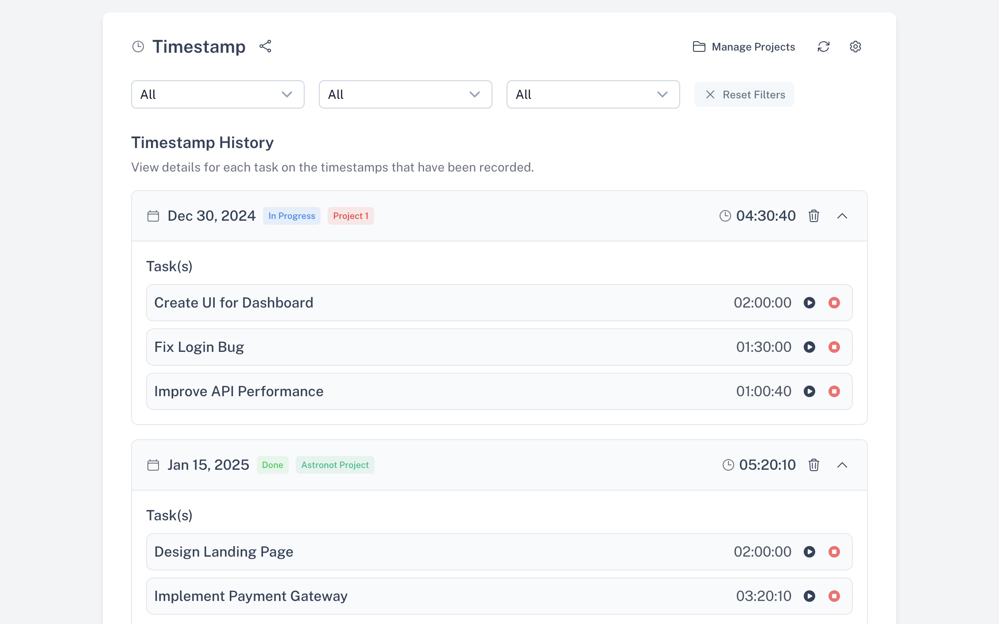

# Timestamp Tracker 🕐

A simple well-structured time tracking application for managing projects and tasks with accurate time measurement.

## Technology Stack

- **Framework**: [Nuxt 3](https://nuxt.com/) (based on [Vue.js](https://vuejs.org))
- **UI Library**: [Nuxt UI 3](https://ui.nuxt.com/)
- **Styling**: [Tailwind CSS 4](https://tailwindcss.com/)
- **State Management**: [Pinia](https://pinia.vuejs.org/)
- **Email Service**: [Resend](https://resend.com/)
- **Language**: [TypeScript](https://www.typescriptlang.org/), [JavaScript](https://developer.mozilla.org/en-US/docs/Web/JavaScript)
- **Package Manager**: [pnpm](https://pnpm.io/)



## Features

- **Project Management**: Create, update, and delete projects
- **Task Tracking**: Add tasks to projects and track time spent on each task
- **Time Management**: Start, pause, and stop timers for tasks (one active task at a time)
- **Filtering & Searching**: Filter timestamp records by various criteria
- **Export Options**: Export your data as CSV, JSON, or send via email

## Project Structure

```
├── components/
│   ├── export/
│   │   ├── Actions.vue
│   │   ├── EmailShare.vue
│   │   ├── FileDownload.vue
│   │   └── FilterCard.vue
│   ├── filters/
│   │   └── Filters.vue
│   ├── ActiveTaskTimer.vue
│   ├── AddTimestamp.vue
│   ├── ProjectManager.vue
│   ├── Socials.vue
│   ├── TimestampEntry.vue
│   └── TimestampTracker.vue
├── composables/
│   └── useTimeUtils.ts
├── pages/
│   └── index.vue
├── stores/
│   ├── filterStore.ts
│   ├── projectStore.ts
│   ├── taskStore.ts
│   └── timerStore.ts
├── server/
│   └── api/
│       └── emails/
│           ├── send.ts
│           └── tsconfig.json
└── types/
    ├── filters-settings.ts
    ├── project.ts
    └── task.ts
```

## Installation

```bash
# Clone the repository
git clone https://github.com/yourusername/timestamp-tracker.git
cd timestamp-tracker

# Install dependencies
pnpm install

# Create .env file and add your Resend API key
echo "NUXT_PRIVATE_RESEND_API_KEY=your_resend_api_key" > .env

# Start development server
pnpm dev
```

## Usage

1. **Create a Project**: Click on "Manage Projects" to create a new project
2. **Add Tasks**: Create tasks under your projects
3. **Track Time**: Start the timer for a task to begin tracking time
4. **Manage Timestamps**: View your timestamp history and filter by date, project, or status
5. **Export Data**: Use the export options to download your data or send it via email

## Key Components

- **TimestampTracker**: Main component that ties everything together
- **ProjectManager**: Handles CRUD operations for projects
- **AddTimestamp**: Creates new timestamp entries
- **ActiveTaskTimer**: Displays and controls the currently running timer
- **Filters**: Allows filtering timestamp history by various criteria
- **Export Options**: Components for exporting data in different formats

## State Management

The application uses Pinia for state management with separate stores:

- **projectStore**: Manages projects data
- **taskStore**: Handles tasks related to projects
- **timerStore**: Controls timer functionality
- **filterStore**: Manages filtering options

## API Endpoints

The application includes a server-side API for sending emails:

- `POST /api/emails/send`: Sends timestamp data via email using Resend

## Future Enhancements

This application is currently a demo but is built to be highly extendable:

1. **Server-Side Rendering**: Leverage Nuxt's SSR capabilities for improved performance and SEO
2. **Database Integration**: Implement a real database for persistent storage of projects, tasks, and time records
3. **User Authentication**: Add multi-user support with role-based permissions
4. **Reporting & Analytics**: Create visual reports and time analysis dashboards
5. **Team Collaboration**: Allow sharing projects and tasks among team members

## License

This project is licensed under the **MIT License**. See the [LICENSE](LICENSE) file for more details.

---

## 🙏 Acknowledgments

- Thanks to the [Nuxt](https://nuxt.com), [Vue.js](https://vuejs.org) team for creating such an amazing framework.
- Shoutout to [Nuxt UI](https://ui3.nuxt.dev/) and [TailwindCSS](https://tailwindcss.com/) for making styling a breeze.
- Special thanks to the open-source community for their endless inspiration and support.

---

## 📧 Contact Me

If you have any questions, suggestions, or just want to connect, feel free to reach out:

- **Contact me via email**: [Get in touch](mailto:engr.arslanbutt@gmail.com)
- **GitHub**: [arslan-butt](https://github.com/arslan-butt)
- **LinkedIn**: [Arslan Butt](https://linkedin.com/in/engrarslanbutt)
